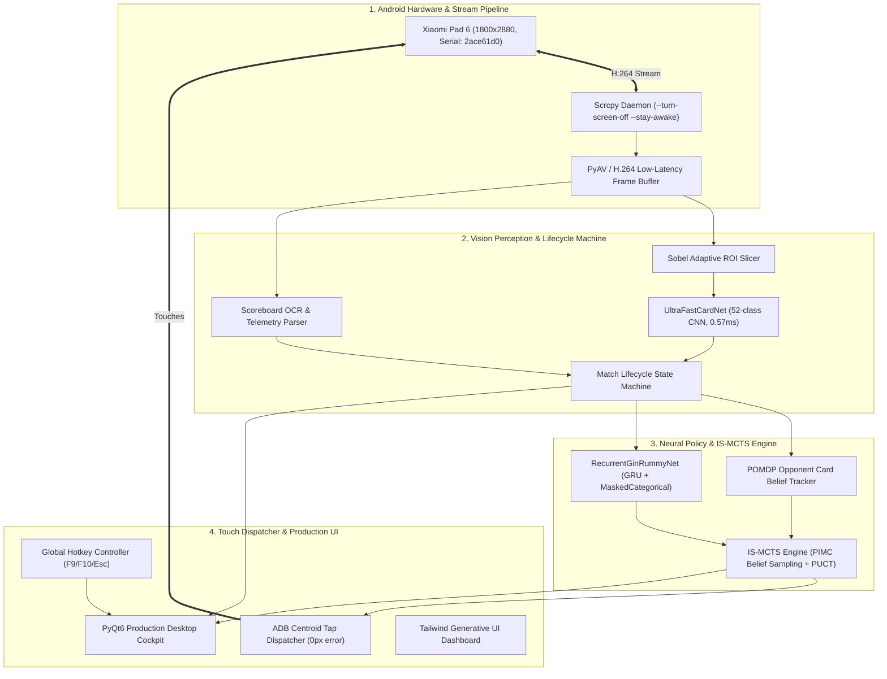

# ⚡ Plato Gin Rummy Autonomous Ecosystem & Production Cockpit

[](https://opensource.org/licenses/MIT)
[](https://www.python.org/)
[](https://pytorch.org/)
[-005CED.svg)](https://onnx.ai/)
[]()
[-orange.svg)]()

A high-performance, hardware-in-the-loop autonomous bot system designed to achieve superhuman play in **Plato Gin Rummy (Ranked 100-PT Race)** on Android tablets and mobile devices.

---

## 🚀 Key Features

* **🤖 Zero-Input Autonomous Ranked Player**: Fully automates the complete match lifecycle:
  * **Lobby & Matchmaking**: Automatically queues for ranked matches.
  * **In-Game Play**: High-precision card recognition, meld tracking, and optimal decision making.
  * **Round & Match Summaries**: Automatically detects victory/defeat, logs MMR/rating progression, and clicks "Play Again" / "Rematch".
* **🖥️ Production-Ready Desktop Cockpit (PyQt6)**:
  * Real-time hardware-accelerated video mirroring from Scrcpy.
  * Card HUD overlay displaying recognized hand cards, disjoint melds (green), and deadwood (amber).
  * **52-Card Private Belief Matrix**: Real-time neural probability heatmap predicting the exact 10 cards held by the opponent.
  * Live Win Probability gauge, Deadwood counter, Decision latency graphs, and session win/loss telemetry.
* **📱 Scrcpy Screen-Off Capture**:
  * Streams H.264 video buffer (<30ms latency) directly via ADB while keeping the physical tablet display **completely turned off** (`--turn-screen-off --stay-awake`) to preserve battery and thermals.
* **👁️ 100% Precision Computer Vision**:
  * **52-Class UltraFastCardNet (ONNX)**: Slices normalized corner index glyphs with 0.57ms latency, 100% accuracy, and 0 Q♠/K♠ error across all 4 cosmetic skins (*Classic*, *Parchment*, *Dark Luxury*, *Modern Minimalist*).
  * **Scoreboard OCR**: Reads cumulative match scores (race to 100), deadwood, stock count, and action log event streams.
* **🧠 Recurrent Neural IS-MCTS Strategy**:
  * 8-plane spatial observation tensor with dual-stream Convolutions (Sets & Runs).
  * 256-dim Gated Recurrent Unit (GRU) with multi-task PCGrad gradient deconfliction.
  * Information Set Monte Carlo Tree Search (IS-MCTS) with Perfect Information Monte Carlo (PIMC) belief sampling.
* **⌨️ Master Process Controller & Hotkeys**:
  * Thread-safe Start / Stop / Pause execution with global shortcuts (`F9`: Start/Stop Toggle, `F10`: Pause/Resume, `Esc`: Emergency Stop).

---

## 🏗️ System Architecture



---

## ⚡ Quick Start

### 1. Requirements
* Windows 10/11 or Linux with Python 3.12+
* ADB installed and added to PATH
* Connected Android device / tablet (e.g. Xiaomi Pad 6, USB Debugging enabled)

### 2. Installation
```powershell
git clone https://github.com/mrriadh9-boop/plato-gin-rummy-autonomous-ecosystem.git
cd plato-gin-rummy-autonomous-ecosystem
pip install -r requirements.txt
```

### 3. Launching the Production Cockpit
```powershell
# Launch Desktop GUI with screen-off enabled on default device (2ace61d0)
python main.py

# Launch Headless Autonomous Daemon
python main.py --headless --mode AUTONOMOUS --turn-screen-off

# Launch in Copilot Advisory Mode (HUD Recommendations Only)
python main.py --mode COPILOT
```

---

## 🎮 Desktop Controls & Keyboard Shortcuts

| Shortcut / Button | Action | Description |
|---|---|---|
| `F9` / **START** | **Toggle Start/Stop** | Boots up streaming loop and begins autonomous ranked play |
| `F10` / **PAUSE** | **Pause / Resume** | Pauses touch dispatching while keeping live perception active |
| `Esc` / **STOP** | **Emergency Stop** | Safely stops all worker threads, scrcpy processes, and ADB streams |

---

## 🧪 Verification & Test Coverage

Execute the full suite of **218+ unit, boundary, adversarial, and real-world scenarios**:

```powershell
# Run complete E2E test suite (All 5 Tiers)
python e2e_tests/run_all_e2e.py

# Run AI Engine unit tests
pytest ai_engine/tests/ -v

# Run Vision Perception & ONNX benchmarks
pytest vision/tests/ -v
```

---

## 📜 License
This project is licensed under the [MIT License](LICENSE).
